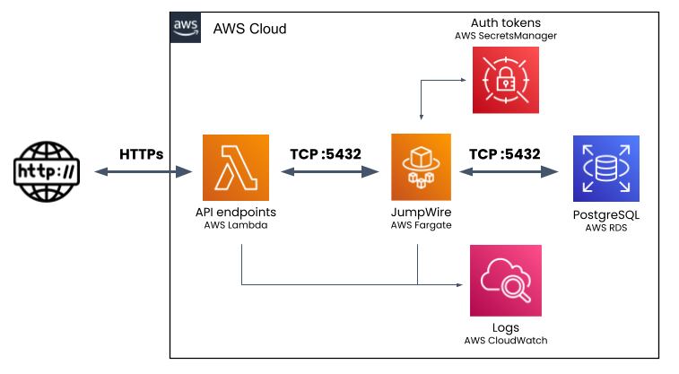

## Terraform template for deploying JumpWire in AWS

This folder contains a Terraform template to deploy the JumpWire engine, as well as a sample application that uses JumpWire as part of a serverless CRUD application.

You can execute a Terraform plan/apply without needing to modify the Terraform template, but it's worth noting that it does not configure a backend for storing state. If you would like to use an existing backend, such as S3, for storing state, you will need to modify [main.tf](main.tf) in this folder.

The following resources are created by this Terraform template:
- KMS key (for use with SecretsManager)
- SecretsManager secret (to store the JUMPWIRE_TOKEN, used for authentication)
- IAM role (to allow the ECS task to read SecretsManager secret)
- ECS service, cluster and task (to run the container on Fargate)
- Cloudwatch log group (for engine logs)

This template does _not_ create a new network for the ECS service, and relies on an existing VPC. You can specify the VPC by passing a list of subnet ids as a variable input.

Most of the variable inputs for this templates have defaults provided which should be appropriate for most deployments. You may wish to override the AWS region, and the ECS task CPU/Memory units, depending on the where you need the task to run and desired scalability.

Required variables:
- `vpc_subnet_ids` is a list of strings that correspond to the subnets where JumpWire should be launched. Typically, these are private subnets in a VPC that is also running an RDS instance or EC2 instances
- `jumpwire_token` is the authentication token listed on your JumpWire account's [configuration page](https://stage.jumpwire.ai/configuration)

Here is a sample command for running a Terraform apply:

```shell
TF_VAR_jumpwire_token='eyJxxxxxx...' \
TF_VAR_vpc_subnet_ids='["subnet-0XXXXXX","subnet-0XXXXX"]' \
terraform apply
```

### Example application using AWS Lambda and RDS (PostgreSQL)

The [example/lambda](example/lambda) subdirectory contains a serverless application to demonstrate how you would set up JumpWire in a real-world application. It deploys three lambda functions, written in Rust, that provide a minimal HTML interface and capabilities for creating and listing records from a PostgreSQL database. It is configured to connect through a JumpWire proxy to a PostgreSQL database, such as one running in RDS.

It demonstrates how seamlessly the JumpWire engine can be integrated into an existing application stack. There is no JumpWire-specific code in the lambda functions, they use a standard Rust PostgreSQL SDK to issue SQL queries. All that is necessary is for Rust code to connect to the JumpWire task is to use a `psql://` connection string with the task IP, instead of the RDS host name.

This is the architecture of the example application, using a JumpWire ECS task to proxy connections between Lambda and RDS:


